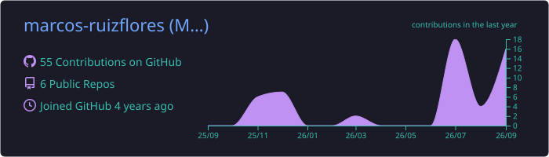
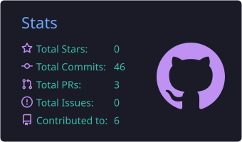
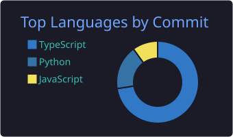

  

  

  

### About me

Backend software engineer from Barcelona. I build Java and Spring Boot microservices that
run in production, and most of my time goes into the parts that make a system hold up:
API design, messaging, caching and everything that happens between services.

I studied Computer Engineering at La Salle Campus Barcelona, where I also spent two years
as an assistant teacher in Operating Systems, Systems Administration and Databases. That
left me with a soft spot for going down to C, Linux and query plans whenever a problem
calls for it.

What I enjoy most is owning a feature end to end, from the first design sketch to seeing
it run in production.

### Tech stack

   
  

### Featured projects

<table>
<tr>
<td width="50%" valign="top">

<a href="https://github.com/marcos-ruizflores/Torii"><b>Torii</b></a>

Flight deal finder for flexible dates. Sliding window search with virtual threads, per-trip TTL cache and failover across flight APIs.

  

</td>
<td width="50%" valign="top">

<a href="https://github.com/marcos-ruizflores/seo-portfolio"><b>seo-portfolio</b></a>

Monorepo of statically exported tool sites with a shared SEO core package.

  

</td>
</tr>
<tr>
<td width="50%" valign="top">

<a href="https://github.com/marcos-ruizflores/criptoBalance"><b>criptoBalance</b></a>

Crypto portfolio tracker with live Binance prices, PnL and price alerts.

  

</td>
<td width="50%" valign="top">

<a href="https://github.com/marcos-ruizflores/gRCP-WhatsUp-Chat"><b>gRPC group chat</b></a>

Terminal group chat over gRPC with vector clock message ordering.

 

</td>
</tr>
</table>

### GitHub stats

  

  
  

  

  

